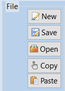
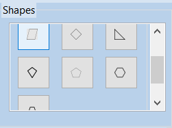
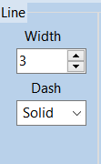
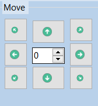
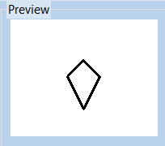
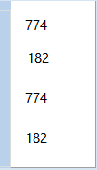
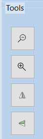
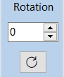

# Nggambar

Nggambar adalah software berbasis desktop yang dibuat sebagai re-make dari software Paint. Software ini dibuat dengan Lazarus.

## Fitur
Pada software Nggambar terdapat beberapa fitur yang mendukung untuk melakukan proses menggabar :
* file 

* shapes

* draw

* line

* color

* move

* preview
* 
* layar untuk menampilkan posisi krusor

* tools

* rotation

## Screenshoot

