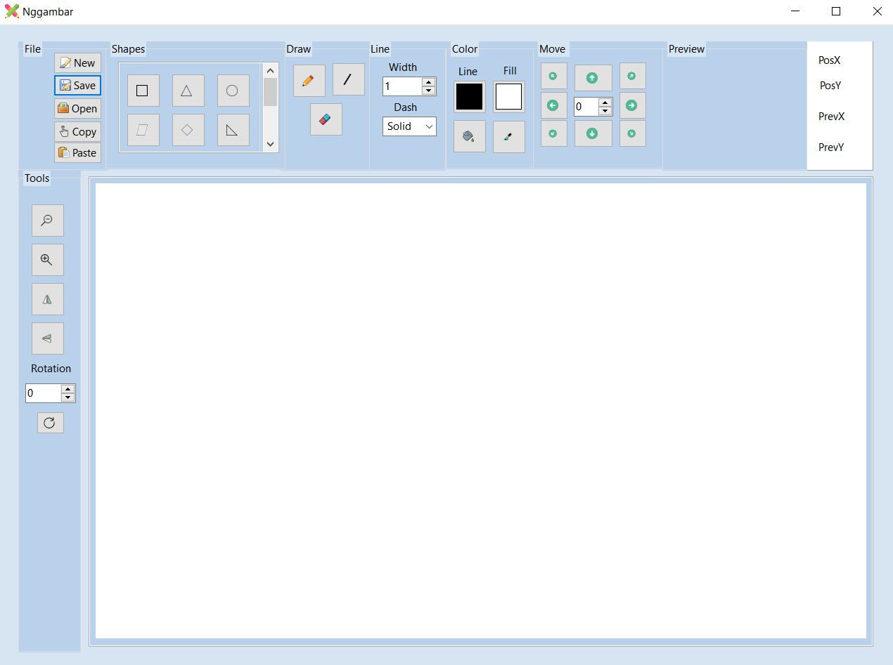
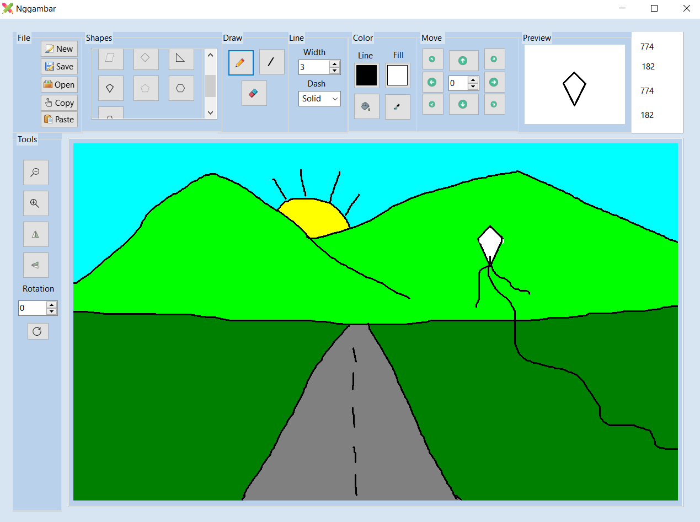

# Nggambar : Remake Paint Software

Nggambar adalah software berbasis desktop yang dibuat sebagai remake Microsoft Paint. Software ini dibuat dengan Lazarus, menggunakan bahasa pemrograman Pascal.

## Fitur
Pada software Nggambar terdapat beberapa fitur yang mendukung untuk melakukan proses menggabar :
* file 
* shapes 
* draw
* line
* color
* move
* preview
* layar untuk menampilkan posisi krusor
* tools
* rotation

## Screenshoot

## Catatan 
Software ini masih sangat mungkin dikembangkan, berikut beberapa hal yang kami pikirkan untuk dapat dikembangkan :
* Fungsi drag and drop
* Aksi (translasi, rotasi, dll) pada gambar dinamis
* Penambahan brush pada line
* Penambahan bentuk pada shapes
* Pengembangan menjadi software yang dapat memproses gambar 3D
